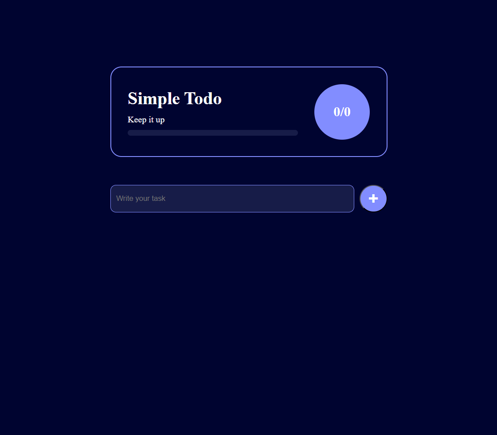

# 📝 Simple Todo App

A minimal and stylish todo list web app built with **HTML**, **CSS**, and **JavaScript**. This app allows you to add, edit, complete, and delete tasks, with progress tracking and local storage support.

## 🚀 Features

- ✅ Add tasks
- ✏️ Edit existing tasks
- ❌ Delete tasks
- 📊 Progress bar showing completion status
- 💾 Tasks saved in **localStorage**
- 🔄 Responsive and simple UI

## 📸 Preview

## 🛠️ Tech Stack

- **HTML5**
- **CSS3**
- **Vanilla JavaScript**

### 🔗 Live Demo

You can check out the live version of the app here:  
[**Simple Todo App on GitHub Pages**](https://abhijitsinha-dev.github.io/Simple-Todo-List/)
